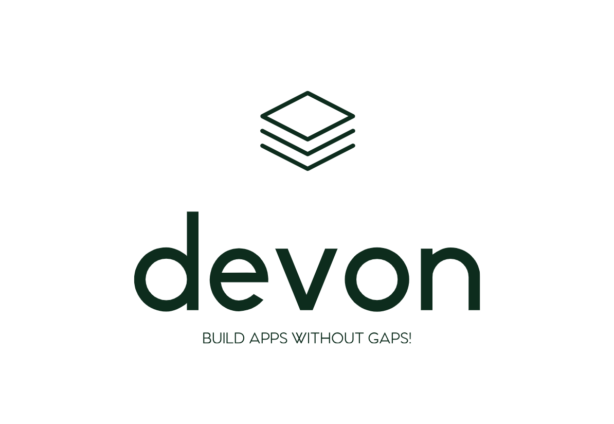

<p align="center">
  
</p>

Build any app that will work across multiple targets: web, mobile, desktop using React and TypeScript.

[](https://circleci.com/gh/nampdn/devon) [](https://waffle.io/nampdn/devon)
 [](https://app.fossa.io/projects/git%2Bgithub.com%2Fnampdn%2Fdevon?ref=badge_shield)
 
## Status

[](https://waffle.io/nampdn/devon/metrics)

## How to use

### Install

```
# Install dependencies for entire project
yarn

# Start development server
yarn dev

# Test all packages
yarn test

# Build all packages
yarn build
```

## License
[](https://app.fossa.io/projects/git%2Bgithub.com%2Fnampdn%2Fdevon?ref=badge_large)

## Credits
Inspired and special thanks to [brunolemos](https://twitter.com/brunolemos) who setup his [DevHubApp](https://github.com/devhubapp/devhub)
